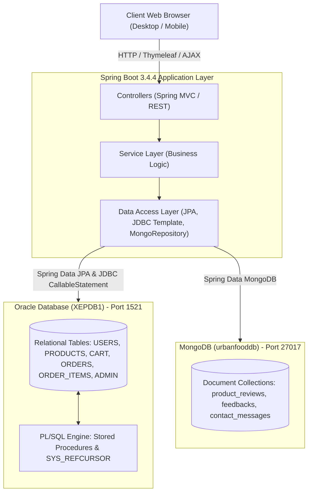
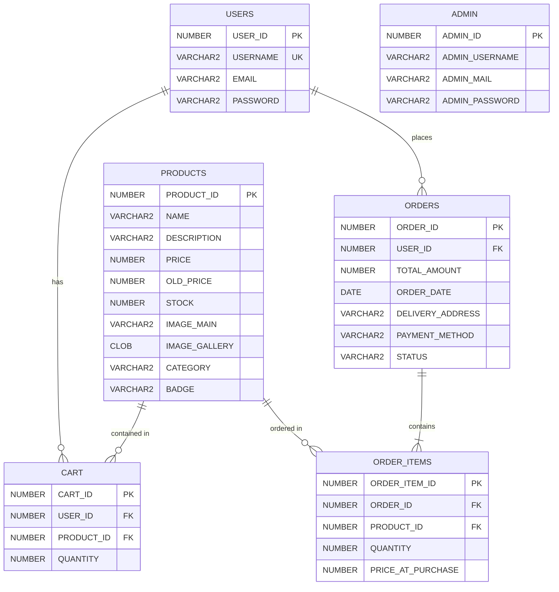

# 🍃 UrbanFood (UrbanEats) — Food & Grocery E-Commerce Platform

[](https://www.oracle.com/java/)
[](https://spring.io/projects/spring-boot)
[](https://www.oracle.com/database/)
[](https://www.mongodb.com/)
[](https://www.thymeleaf.org/)
[](https://www.nibm.lk/)

> **Academic Project**: Higher Diploma in Software Engineering (HDSE)  
> **Course Module**: Data Management II (DM02 Project)  
> **Student**: Pawan Mihiranga  
> **Institution**: National Institute of Business Management (NIBM)

---

## 📌 Table of Contents
- [Project Overview](#-project-overview)
- [Polyglot Persistence Architecture](#-polyglot-persistence-architecture)
- [Database Design & Implementation](#-database-design--implementation)
  - [Oracle Database (Relational Engine)](#1-oracle-database-relational-engine)
  - [Entity-Relationship Diagram (ERD)](#entity-relationship-diagram-erd)
  - [Advanced PL/SQL Stored Procedures & Business Logic](#advanced-plsql-stored-procedures--business-logic)
  - [MongoDB (Document Engine)](#2-mongodb-nosql-document-engine)
- [Core Features & Modules](#-core-features--modules)
- [Tech Stack](#-tech-stack)
- [Project Structure](#-project-structure)
- [Getting Started & Installation](#-getting-started--installation)
  - [Prerequisites](#prerequisites)
  - [1. Oracle Database Setup](#1-oracle-database-setup)
  - [2. MongoDB Setup](#2-mongodb-setup)
  - [3. Application Configuration](#3-application-configuration)
  - [4. Build & Run](#4-build--run)
- [API & Controller Endpoints](#-api--controller-endpoints)
- [Author & Acknowledgments](#-author--acknowledgments)

---

## 📖 Project Overview

**UrbanFood** is an enterprise-grade full-stack e-commerce web platform developed to deliver grocery and food items directly to urban consumers. The platform supports seamless product discovery, category filtering, persistent shopping cart operations with dynamic category-based tax calculation, secure checkout, and user feedback mechanisms.

The primary focus of this project is demonstrating **Advanced Data Management concepts**, specifically:
* **Polyglot Persistence**: Synergizing a relational database (Oracle 21c/XE) with a NoSQL document database (MongoDB).
* **Database-Side Business Logic**: Offloading critical transactional and computational operations (cart aggregations, category VAT rates, and atomic order placement) directly to **Oracle PL/SQL Stored Procedures and Cursors**.
* **High-Volume Unstructured/Semi-Structured Data Handling**: Leveraging MongoDB for dynamic user reviews, customer inquiries, and rating management.

---

## 🏛 Polyglot Persistence Architecture

The system utilizes an architectural pattern where data stores are chosen based on the functional and structural requirements of each domain:



| Domain Requirement | Database Engine | Rationale |
| :--- | :--- | :--- |
| **User Accounts, Products, Carts, Orders** | **Oracle Database (19c/21c XE)** | Strict ACID compliance, relational integrity, foreign key constraints, atomic multi-table order transactions, and high-performance server-side PL/SQL computation. |
| **Product Reviews, Testimonials, Inquiries** | **MongoDB** | Schema flexibility, nested document structure, high write throughput, and independent scalability for customer sentiment data. |

---

## 🗄 Database Design & Implementation

### 1. Oracle Database (Relational Engine)

#### Schema Overview:
* **`USERS`**: Manages registered customer profiles and authentication credentials.
* **`PRODUCTS`**: Catalog items containing prices, stock levels, category classifications, badges, and image galleries stored in Oracle `CLOB`.
* **`CART`**: Session/user-bound persistent shopping cart tracking selected product items and quantities.
* **`ORDERS`**: Master order headers with delivery addresses, total amounts, timestamps, and order statuses.
* **`ORDER_ITEMS`**: Detail order line items linked via foreign keys to parent orders and respective products.
* **`ADMIN`**: Privileged administrator accounts.

---

#### Entity-Relationship Diagram (ERD)



---

#### Advanced PL/SQL Stored Procedures & Business Logic

All core data-intensive operations execute directly within Oracle PL/SQL stored procedures:

| Stored Procedure | Type | Description |
| :--- | :--- | :--- |
| `AddToCart(p_user_id, p_product_id, p_quantity)` | Procedure | Evaluates item existence; performs atomic quantity increments if existing, or creates a new cart row via sequence. |
| `CALCULATE_CART_TOTAL(p_user_id, OUT p_total, OUT p_vat, OUT p_shipping)` | Cursor & Procedure | Opens a cursor over user cart items, evaluates dynamic VAT rates per product category, calculates total subtotal, taxes, and applies flat shipping. |
| `place_order(p_user_id, p_total, p_address, p_payment)` | Transactional Procedure | Executes an atomic transaction: writes to `ORDERS` returning `order_id`, iterates over user's cart items inserting into `ORDER_ITEMS`, and purges active cart items with rollback protection. |
| `GetUserCartItems(p_user_id, OUT p_cart_items)` | Cursor (`SYS_REFCURSOR`) | Joins `CART` and `PRODUCTS` to stream cart items with pricing, names, and images directly to Java. |
| `GET_ALL_PRODUCTS(OUT p_products)` | Cursor (`SYS_REFCURSOR`) | Retrieves all active products ordered by category and ID. |
| `GET_PRODUCTS_BY_CATEGORY(p_category, OUT p_products)` | Cursor (`SYS_REFCURSOR`) | Streams category-filtered products for catalog browsing. |
| `GET_ALL_CATEGORIES(OUT p_categories)` | Cursor (`SYS_REFCURSOR`) | Returns unique categories present in the system. |
| `ADMIN_LOGIN_PROC(p_username, p_password, OUT p_result)` | Security Procedure | Case-insensitive administrator authentication check returning binary status flag. |
| `INSERT_PRODUCT(...)` / `UPDATE_PRODUCT(...)` | DML Procedures | Admin operations for maintaining product catalog details and gallery references. |
| `REMOVE_CART_ITEM(p_cart_id)` / `UpdateCartItem(...)` | DML Procedures | Item-level cart updates and quantity modifications with validation. |

##### PL/SQL Highlight: Category-Based Tax Computation
```sql
create or replace PROCEDURE CALCULATE_CART_TOTAL (
    p_user_id       IN  NUMBER,
    p_total         OUT NUMBER,
    p_vat           OUT NUMBER,
    p_shipping      OUT NUMBER
) AS
    v_subtotal      NUMBER := 0;
    v_vat           NUMBER := 0;
    v_shipping      NUMBER := 250;  
    v_cat_vat       NUMBER := 0;

    CURSOR cart_cursor IS
        SELECT p.price, c.quantity, p.category
        FROM URBANFOOD.Cart c
        JOIN URBANFOOD.Products p ON c.product_id = p.product_id
        WHERE c.user_id = p_user_id;
BEGIN
    FOR rec IN cart_cursor LOOP
        CASE rec.category
            WHEN 'Food & Drinks' THEN v_cat_vat := 0.05;
            WHEN 'Vegetables'    THEN v_cat_vat := 0.02;
            WHEN 'Dried Foods'   THEN v_cat_vat := 0.03;
            WHEN 'Bread & Cake'  THEN v_cat_vat := 0.04;
            WHEN 'Fish & Meat'   THEN v_cat_vat := 0.06;
            ELSE v_cat_vat := 0.05;
        END CASE;

        v_subtotal := v_subtotal + (rec.price * rec.quantity);
        v_vat      := v_vat + (rec.price * rec.quantity * v_cat_vat);
    END LOOP;

    p_total    := v_subtotal;
    p_vat      := v_vat;
    p_shipping := v_shipping;
END;
```

---

### 2. MongoDB (NoSQL Document Engine)

MongoDB is configured under database `urbanfooddb` with the following document collections:

#### `product_reviews` Collection
Stores user reviews with numeric ratings and creation timestamps.
```json
{
  "_id": "67041ab...",
  "productId": 12,
  "username": "kasun_perera",
  "email": "kasun@example.com",
  "comment": "Fresh vegetables, prompt delivery!",
  "rating": 5,
  "createdAt": "2026-10-07T14:32:00.000Z"
}
```

#### `feedbacks` Collection
Collects general customer testimonials loaded dynamically onto the website.
```json
{
  "_id": "67042cd...",
  "name": "Nimal Fernando",
  "message": "Excellent grocery packaging and quick delivery."
}
```

#### `contact_messages` Collection
Stores inquiries sent via the Contact Us interface.
```json
{
  "_id": "67043ef...",
  "name": "Amali Silva",
  "email": "amali@example.com",
  "phone": "+94771234567",
  "message": "Do you deliver to suburban areas outside Colombo?"
}
```

---

## 🚀 Core Features & Modules

### 🛒 Customer Features
* **Interactive Home & Category Catalog**: Filter grocery products by dynamic categories (*Food & Drinks, Vegetables, Dried Foods, Bread & Cake, Fish & Meat*).
* **Product Details & Image Carousel**: Comprehensive product view with rich gallery rendering and dynamic review lists.
* **Persistent Cart Management**: Real-time cart updates with stored procedure-calculated category tax and delivery fees.
* **Global Cart Header Widget**: [GlobalCartDataAdvice](file:///c:/Users/pawan/Documents/Desktop/NIBM%20Work%20Space/HDSE/UrbanFood/UrbanEats/src/main/java/dm02project/nibm/kahdse242f/urbanfood/controller/GlobalCartDataAdvice.java) injects current cart items and subtotals across all pages seamlessly.
* **End-to-End Checkout**: Delivery address form and automated order placement backed by Oracle transaction integrity.
* **Customer Interaction**: Submit ratings/reviews on individual products and general feedback.

### 🛡 Administrator Features
* **Dedicated Admin Authentication**: Secure login checking against stored procedure `ADMIN_LOGIN_PROC`.
* **Product Management (CRUD)**: Add new products with multipart image upload support, edit product attributes, and delete obsolete listings.
* **Order Tracking & Item Inspection**: Modal-based line item viewer for reviewing items linked to any customer order.

---

## 🛠 Tech Stack

### Backend
* **Java 17** (LTS)
* **Spring Boot 3.4.4**
* **Spring Data JPA** & **Spring Data MongoDB**
* **Spring JDBC Template** & `SimpleJdbcCall`
* **Hibernate ORM 6.6**

### Databases
* **Oracle Database 21c Express Edition / 19c** (JDBC Driver `ojdbc11`)
* **MongoDB Community Server 7.0+**

### Frontend
* **Thymeleaf Template Engine**
* **HTML5, SCSS / Vanilla CSS3**
* **JavaScript (ES6+) & jQuery**
* **Bootstrap Grid & Responsive Components**

### Build & Tooling
* **Apache Maven** (Wrapper included)
* **Git** Version Control

---

## 📂 Project Structure

```text
UrbanEats/
├── database/
│   └── urbanfood db.sql          # Complete Oracle DDL, DML, Sequences & Stored Procedures
├── src/
│   ├── main/
│   │   ├── java/dm02project/nibm/kahdse242f/urbanfood/
│   │   │   ├── controller/       # Spring MVC & REST Controllers
│   │   │   │   ├── AdminController.java
│   │   │   │   ├── CartController.java
│   │   │   │   ├── CartItemController.java
│   │   │   │   ├── ContactMessageController.java
│   │   │   │   ├── FeedbackController.java
│   │   │   │   ├── GlobalCartDataAdvice.java   # Injects cart data globally
│   │   │   │   ├── OrderController.java
│   │   │   │   ├── PageController.java
│   │   │   │   ├── ProductController.java
│   │   │   │   ├── ProductReviewController.java
│   │   │   │   └── UserController.java
│   │   │   ├── dto/              # Data Transfer Objects (CartItem, CartUpdateRequest)
│   │   │   ├── entity/           # JPA & MongoDB Document Entities
│   │   │   │   ├── Admin.java
│   │   │   │   ├── ContactMessage.java         # Mongo @Document
│   │   │   │   ├── Feedback.java               # Mongo @Document
│   │   │   │   ├── Product.java                # JPA @Entity
│   │   │   │   ├── ProductReview.java          # Mongo @Document
│   │   │   │   └── User.java                   # JPA @Entity
│   │   │   ├── repository/       # Repositories (JPA, Mongo, JDBC Stored Procedure calls)
│   │   │   ├── service/          # Business logic services
│   │   │   └── UrbanfoodApplication.java
│   │   └── resources/
│   │       ├── application.properties          # Oracle & MongoDB configurations
│   │       ├── static/           # CSS, JS, Images, SCSS, Webfonts
│   │       └── templates/        # Thymeleaf Views (index, shop-grid, cart, checkout, admin, etc.)
│   └── test/
├── pom.xml                       # Maven build configuration
└── README.md                     # Project documentation
```

---

## ⚡ Getting Started & Installation

### Prerequisites
* **Java Development Kit (JDK) 17** or higher
* **Oracle Database XE 18c/21c** running locally on port `1521`
* **MongoDB Server** running locally on port `27017`
* **Maven 3.8+** (or use bundled `./mvnw`)

---

### 1. Oracle Database Setup
1. Log in to your Oracle Database instance as `SYS` or `SYSTEM`:
   ```sql
   sqlplus sys/your_sys_password@localhost:1521/XEPDB1 as sysdba
   ```
2. Create the `URBANFOOD` user schema and grant permissions:
   ```sql
   CREATE USER URBANFOOD IDENTIFIED BY 12345;
   GRANT CONNECT, RESOURCE, DBA TO URBANFOOD;
   GRANT UNLIMITED TABLESPACE TO URBANFOOD;
   ```
3. Connect as `URBANFOOD` and execute the schema script:
   ```sql
   CONNECT URBANFOOD/12345@localhost:1521/XEPDB1;
   @database/"urbanfood db.sql";
   ```

---

### 2. MongoDB Setup
Ensure MongoDB is running on port `27017`. MongoDB will automatically provision the database and collections upon the first write operation, or you can start the MongoDB service:
```bash
# Windows Service
net start MongoDB

# Or via mongosh
mongosh
use urbanfooddb
```

---

### 3. Application Configuration
Verify or modify database credentials in `src/main/resources/application.properties`:

```properties
spring.application.name=URBANFOOD

# Oracle Database Configuration
spring.datasource.url=jdbc:oracle:thin:@localhost:1521/XEPDB1
spring.datasource.username=URBANFOOD
spring.datasource.password=12345
spring.datasource.driver-class-name=oracle.jdbc.OracleDriver

# Hibernate / JPA
spring.jpa.show-sql=true
spring.jpa.hibernate.ddl-auto=none
spring.jpa.properties.hibernate.dialect=org.hibernate.dialect.OracleDialect

# MongoDB Configuration
spring.data.mongodb.uri=mongodb://localhost:27017/urbanfooddb

# Multipart File Upload Limits
spring.servlet.multipart.max-file-size=5MB
spring.servlet.multipart.max-request-size=10MB
```

---

### 4. Build & Run

#### Using Maven Wrapper (Windows PowerShell / CMD):
```powershell
# Compile and package
.\mvnw.cmd clean package -DskipTests

# Run the application
.\mvnw.cmd spring-boot:run
```

#### Access the Application:
* **Customer Storefront**: [http://localhost:8080](http://localhost:8080)
* **Shop Catalog**: [http://localhost:8080/shop-grid](http://localhost:8080/shop-grid)
* **Admin Login**: [http://localhost:8080/admin/login](http://localhost:8080/admin/login)

---

## 📡 API & Controller Endpoints

| HTTP Method | Route | Controller | Functionality |
| :--- | :--- | :--- | :--- |
| `GET` | `/` | `ProductController` | Renders storefront with categorized products |
| `GET` | `/shop-grid` | `ProductController` | Displays all catalog items |
| `GET` | `/product-details/{id}` | `ProductController` | View single product with gallery images |
| `POST` | `/add-to-cart` | `CartController` | Invokes `AddToCart` stored procedure |
| `GET` | `/cart` | `CartItemController` | Displays user cart with tax & shipping |
| `POST` | `/cart/update` | `CartItemController` | AJAX route to update item quantities |
| `GET` | `/cart/remove/{cartId}` | `CartItemController` | Removes product from user cart |
| `POST` | `/place-order` | `OrderController` | Executes PL/SQL atomic `place_order` procedure |
| `POST` | `/register` | `UserController` | Registers new user account |
| `POST` | `/login` | `UserController` | Authenticates customer account |
| `POST` | `/admin/login` | `AdminController` | Authenticates admin via `ADMIN_LOGIN_PROC` |
| `GET` | `/admin/dashboard` | `AdminController` | Admin administration overview |
| `POST` | `/admin/add-product` | `AdminController` | Uploads and inserts new product |
| `POST` | `/product/submitReview/{id}` | `ProductReviewController` | Persists review to MongoDB |
| `POST` | `/api/feedbacks` | `FeedbackController` | REST API to submit testimonial |
| `GET` | `/api/feedbacks` | `FeedbackController` | REST API returning recent testimonials |

---

## 👨‍💻 Author & Acknowledgments

* **Developer**: **Pawan Mihiranga** ([@PawanBulathwaththa](https://github.com/PawanBulathwaththa))
* **Email**: pawanbulatwaththa@gmail.com
* **Batch**: KAH-DSE-24.2F
* **Institution**: **National Institute of Business Management (NIBM)** — School of Computing
* **Module**: Higher Diploma in Software Engineering — *Data Management II*

---
*Created for academic evaluation demonstrating advanced relational modeling, PL/SQL stored procedure development, and polyglot persistence.*
